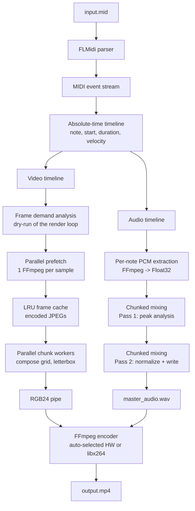

<div align="center">

```                                                                           
 ▄▄▄▄▄▄▄ ▄▄▄                   ▄▄▄▄▄▄▄                      ▄▄             
███▀▀▀▀▀ ███                  █████▀▀▀                      ██             
███▄▄    ███            ██ ██  ▀████▄   ▀▀█▄ ███▄███▄ ████▄ ██ ▄█▀█▄ ████▄ 
███▀▀    ███      ▀▀▀▀▀ ██▄██    ▀████ ▄█▀██ ██ ██ ██ ██ ██ ██ ██▄█▀ ██ ▀▀ 
███      ████████        ▀█▀  ███████▀ ▀█▄██ ██ ██ ██ ████▀ ██ ▀█▄▄▄ ██    
                                                      ██                   
                                                      ▀▀                   
```

**Turn a MIDI file into a video performance using pre-recorded clips of individual instrument notes.**

A Kotlin/JVM pipeline that reads a `.mid` file, drives a musical timeline, and stitches
per-note sample videos into a synchronized `.mp4` — built on top of the from-scratch
[**FLMidi**](https://github.com/LucasAlfare/FLMidi/) parser.

[](https://kotlinlang.org/)
[](https://ffmpeg.org/)
[](https://github.com/LucasAlfare/FLMidi/)
[](https://github.com/LucasAlfare/FLBinary/)
[](#license)

</div>

---

## Table of Contents

- [What is FL-vSampler?](#what-is-fl-vsampler)
- [Why this project exists](#why-this-project-exists)
- [Features](#features)
- [How it works](#how-it-works)
  - [Pipeline overview](#pipeline-overview)
  - [The video composition strategy](#the-video-composition-strategy)
- [Requirements](#requirements)
- [Getting started](#getting-started)
  - [1. Install the JDK](#1-install-the-jdk)
  - [2. Install FFmpeg](#2-install-ffmpeg)
  - [3. Clone the project](#3-clone-the-project)
  - [4. Provide the input](#4-provide-the-input)
  - [5. Run](#5-run)
- [Preparing your samples](#preparing-your-samples)
- [Preparing your MIDI](#preparing-your-midi)
- [Configuration](#configuration)
- [Project structure](#project-structure)
- [Architecture](#architecture)
- [Performance & benchmarks](#performance--benchmarks)
- [Current limitations & roadmap](#current-limitations--roadmap)
- [Related projects](#related-projects)
- [License](#license)

---

## What is FL-vSampler?

**FL-vSampler is a video sampler.** It takes two inputs:

1. A **MIDI file** (`.mid`) — the score: which notes play, when, for how long, and how hard.
2. A **folder of sample videos** — one short `.mp4` per note of the instrument
   (e.g. `C3.mp4`, `C#3.mp4`, `D3.mp4`, …), each containing the audio **and**
   the visual performance of that single note.

And it produces a single output:

3. An **`output.mp4`** — the performance rendered as a continuous video,
   with all per-note audio mixed into a normalized master track and all
   per-note videos cut together frame-by-frame along the MIDI timeline.

In other words: **you give it a MIDI score and a library of note clips; it "plays"
the score back as a video.** Think of it as a virtual instrument whose keys are
video files instead of samples, and whose sheet music is a `.mid`.

```text
  input.mid   ─┐
               ├──►  FL-vSampler  ──►  output.mp4
samples/*.mp4 ─┘
```

> **Note on scope.** FL-vSampler is *not* a synthesizer. It does not generate audio
> from scratch. It *replays* audio and video that you already recorded — exactly like
> a hardware sampler replays recorded waveforms.

---

## Why this project exists

There are two motivations, and both matter.

### 1. To use **FLMidi** in a real, non-trivial project

[FLMidi](https://github.com/LucasAlfare/FLMidi/) is a MIDI parsing and
interpretation library written **from scratch** in Kotlin, on top of
[FLBinary](https://github.com/LucasAlfare/FLBinary/) for binary I/O. _FL-vSampler_
is its **flagship consumer**: an end-to-end application that exercises the parser
against real-world files, forces the timeline/tempo-map handling to be correct,
and validates that the abstraction is actually pleasant to use from an
application codebase.

Everything related to MIDI in this repository — track merging, delta-tick
accumulation, tempo-map integration, note-on/note-off pairing, velocity and
channel handling — goes through FLMidi. There is **no** other MIDI dependency.

### 2. To explore a memory-bounded video/audio pipeline

Rendering a full song as raw frames is memory-hostile. FL-vSampler was also a
playground for a **streaming, bounded-memory** design: chunked audio mixing,
two-pass peak normalization, LRU frame caching, parallel chunk rendering,
and direct piping into FFmpeg — so that a 10-minute song does not blow up
the heap.

---

## Features

- **Pure-Kotlin MIDI front end** — powered entirely by **FLMidi** (built on **FLBinary**).
- **Absolute-time timeline** — delta ticks are converted to milliseconds through a
  full tempo map, with microsecond-precision accumulation to avoid drift.
- **Polyphonic audio mixing** — overlapping notes are summed with a short cosine
  fade-out so tails decay cleanly.
- **Two-pass peak normalization** — the master WAV is guaranteed to sit at
  `0.95` peak (or lower if already quieter) with no clipping.
- **Chunked audio processing** — audio is mixed in configurable windows; the full
  master buffer never lives in RAM at once.
- **Bounded LRU frame cache** — encoded frames are cached with a configurable
  megabyte budget; the least-recently-used frames are evicted automatically.
- **Parallel frame prefetch** — one FFmpeg process per sample, run concurrently
  before the render loop starts.
- **Parallel chunk rendering** — video frames are rendered by a pool of worker
  threads, one chunk of frames per task, with a buffer pool eliminating
  per-chunk allocations.
- **Automatic hardware encoding** — FL-vSampler probes FFmpeg for
  `h264_amf`, `h264_nvenc` and `h264_qsv`, picks the first one that actually
  works with a test encode, and falls back to `libx264` if none is available.
- **Direct streaming to FFmpeg** — raw BGR frames are piped straight into the
  encoder; no intermediate segments are written to disk.
- **Adaptive grid composition** — for *N* simultaneous notes/tracks, a
  matching grid (1×1, 2×1, 3×1, 2×2, 3×2, 4×2, 3×3, or an adaptive layout
  beyond that) is chosen automatically. Each cell is letterboxed to preserve
  the sample's aspect ratio.
- **Optional pause sample** — `samples/pause.mp4` plays during rests; if absent,
  a fallback frame is used.

---

## How it works

### Pipeline overview



### Step by step

#### 1. MIDI parsing (FLMidi)

The `.mid` file is parsed with **FLMidi**. Every track is merged into a single
absolute-tick timeline, a tempo map is built from every `SetTempoMetaEvent`, and
note-on / note-off pairs are matched per `(track, channel, pitch)` using a FIFO
queue. A note-on with velocity `0` is treated as a note-off, as per the MIDI
spec. Tick positions are finally integrated through the tempo map into
**milliseconds**.

#### 2. Two timelines

From the parsed note list, two derived timelines are built:

- **Audio timeline** — an ordered list of `TimelineNote` and `TimelinePause`
  events. Overlaps are preserved so the mixer can render them polyphonically.
- **Video timeline** — grouped by MIDI track, each track is sliced at **every
  note boundary** (each note's `start` and `end`), producing
  `VideoNotesSegment`s. Inside a segment, the set of active notes is constant.

The video timeline is what makes rendering cheap: because the active set does
not change inside a segment, the on-screen grid layout can be reasoned about
per segment.

#### 3. Audio preparation

Only the audio of samples that the MIDI actually uses is extracted. Each sample
video is passed through FFmpeg to produce stereo 16-bit PCM at 48 kHz, decoded
into two `FloatArray`s in `[-1.0, 1.0]`.

#### 4. Master audio (two passes, chunked)

The audio timeline is processed in fixed-size windows (default: 10 s per chunk):

- **Pass 1** — mixes every event into a scratch buffer, chunk by chunk, and
  records the **global peak**.
- **Pass 2** — mixes again, multiplies by `0.95 / peak` when the peak exceeds
  `0.95`, and **streams** the interleaved PCM16 output into `master_audio.wav`.

A short **cosine fade-out** (15 ms) is applied to the tail of each note so
successive notes don't click when they butt up against each other.

#### 5. Video rendering

Before the render loop starts, FL-vSampler **dry-runs the loop** to compute, per
sample file, the highest frame index that will ever be requested. It then
**prefetches** all of those frames in parallel — one FFmpeg process per sample,
writing an `image2pipe` MJPEG stream that is split into individual JPEGs and
pushed into the LRU cache.

The render loop itself is **parallelized in chunks**: a fixed pool of worker
threads renders `videoChunkFrames` frames per task into a pooled byte buffer,
and the main thread writes each finished chunk into FFmpeg's stdin. Frames
inside a chunk are served from the LRU cache, so **no FFmpeg process is spawned
inside the frame loop**.

Each output frame:

1. Advances to the current `VideoNotesSegment` per track.
2. Chooses a grid layout from the number of active notes in that track.
3. Draws each active note's sample frame letterboxed inside its grid cell.
4. Converts the composited canvas (`TYPE_3BYTE_BGR`) into the output buffer via
   a bulk `System.arraycopy`.
5. Writes the chunk into the FFmpeg encoder's stdin.

#### 6. Final encode

FFmpeg receives the raw BGR frames from `pipe:0` and the `master_audio.wav`
from disk, and produces H.264 / AAC / `yuv420p`:

```text
ffmpeg -y \
  -f rawvideo -pixel_format bgr24 \
  -video_size {W}x{H} -framerate {FPS} \
  -i pipe:0 \
  -i master_audio.wav \
  -c:v {ENCODER} {ENCODER_PARAMS} -pix_fmt yuv420p \
  -c:a aac -b:a 192k \
  -shortest output.mp4
```

`{W}x{H}` is the output resolution, derived from the first decoded frame of the
first non-pause sample. `{ENCODER}` and `{ENCODER_PARAMS}` are resolved at
runtime by `EncoderSelector`, which probes FFmpeg and picks the best working
hardware encoder, falling back to `libx264 -preset fast -crf 23`.

---

### The video composition strategy

**Each track is sliced at every note boundary.** Every `start` and every
`start + duration` becomes a cut point. Between two consecutive cut points, the
set of notes that are *fully sounding* is constant — call it the **active set**.
That interval is a `VideoNotesSegment`.

**The outer grid is sized by the number of MIDI tracks.** Each track gets its
own cell in the outer grid; tracks are laid out with the same adaptive rule as
notes.

**Inside each track's cell, the inner grid is sized by `|active set|`** for that
track:

| Active notes | Layout | Description                                |
|:------------:|:------:|:-------------------------------------------|
|     0–1      | 1 × 1  | A single full cell                         |
|      2       | 2 × 1  | Two side-by-side cells                     |
|      3       | 3 × 1  | Three vertical cells                       |
|      4       | 2 × 2  | A 2×2 grid                                 |
|     5–6      | 3 × 2  | A 3×2 grid                                 |
|     7–8      | 4 × 2  | A 4×2 grid                                 |
|      9       | 3 × 3  | A 3×3 grid                                 |
|     > 9      |   —    | Adaptive near-square grid                  |

**Within a segment, each cell plays the sample of its note, letterboxed.**
The frame index for note *n* at time *t* is:

```text
sampleFrameIndex = floor((t − note.start) × fps / 1000)
```

So the sample's playback clock starts **exactly when the note starts on the
MIDI timeline** and advances at the output frame rate. The image is scaled to
fit its cell while preserving the source aspect ratio:

- If the image is wider than the cell → fit by width, add vertical bars.
- If the image is taller than the cell → fit by height, add horizontal bars.

No stretching ever happens — only contain-fit. Fallback frames (used when no
note is sounding in a cell) are cached after resize, keyed by
`(width, height)`, so the same letterboxed fallback image is not rescaled on
every frame.

**Everything is composited into a single `BufferedImage` at the output
resolution** — which is taken from the first frame of the first non-pause
sample. The canvas is allocated **once per worker** and reused for the whole
render chunk.

---

## Requirements

| Component    | Version           | Notes                                                 |
|:-------------|:------------------|:------------------------------------------------------|
| **JDK**      | 17 or newer       | Temurin / Adoptium recommended.                       |
| **Kotlin**   | 1.9+ (via Gradle) | Handled by the Gradle wrapper if present.             |
| **FFmpeg**   | any recent build  | Must be on `PATH`. Used for decode, prefetch, encode. |
| **Git**      | any               | To clone the repo.                                    |
| **FLMidi**   | latest            | MIDI parsing. Pulled in as a dependency.              |
| **FLBinary** | latest            | Transitive dependency of FLMidi.                      |

---

## Getting started

This section assumes a **freshly formatted machine** with nothing installed.

### 1. Install the JDK

Install a JDK 17+ (Temurin is a safe default).

- **Windows** — download from [Adoptium](https://adoptium.net/), run the
  installer, and make sure "Set JAVA_HOME" is checked.
- **macOS** — `brew install --cask temurin`
- **Linux (Debian/Ubuntu)** — `sudo apt install temurin-17-jdk` (after adding
  the Adoptium repo) or `sudo apt install openjdk-17-jdk`.

Verify:

```bash
java -version
```

### 2. Install FFmpeg

FL-vSampler shells out to FFmpeg for *everything* multimedia-related, so it must
be on your `PATH`.

- **Windows** — download a build from [gyan.dev](https://www.gyan.dev/ffmpeg/builds/),
  extract it, and add the `bin` folder to `PATH`.
- **macOS** — `brew install ffmpeg`
- **Linux** — `sudo apt install ffmpeg`

Verify:

```bash
ffmpeg -version
```

### 3. Clone the project

```bash
git clone https://github.com/LucasAlfare/FL-vSampler.git
cd FL-vSampler
```

### 4. Provide the input

Place your MIDI file at the project root:

```text
input.mid
```

Place your per-note sample videos inside `samples/`:

```text
samples/
├── C3.mp4
├── C#3.mp4
├── D3.mp4
├── D#3.mp4
├── E3.mp4
├── ...
└── pause.mp4   ← optional
```

> Sample filenames **must** match the exact scientific pitch notation produced by
> FLMidi: `C`, `C#`, `D`, `D#`, `E`, `F`, `F#`, `G`, `G#`, `A`, `A#`, `B`
> followed by the octave number. **Sharps only — no flats.** `Db3.mp4` will not
> be found; it must be named `C#3.mp4`.

### 5. Run

From the project root:

```bash
./gradlew run
```

Or build a runnable JAR and run it directly:

```bash
./gradlew shadowJar
java -jar build/libs/fl-vsampler-all.jar
```

On success, the tool prints progress per stage and writes:

```text
output.mp4
```

Temporary files are written under `render_cache/` and **deleted automatically**
on success.

---

## Preparing your samples

Sample quality has an outsized effect on the final render. Before running the
tool, sanitize your sample library:

- **One clip per note.** Every MIDI pitch you use must have a matching
  `<note>.mp4` file. Missing notes are skipped with a warning — they simply
  won't sound or appear.
- **Trim the head.** Cut each sample **exactly at the moment the note starts
  sounding**. Any micro-silence at the start will produce audible and visible
  gaps between consecutive notes on the timeline.
- **Consistent duration is strongly recommended.** Samples of wildly different
  lengths will end at unpredictable moments (the mixer will fade them out, but
  the video will cut back to the fallback or the next grid). A uniform length —
  or at least a length long enough to cover the longest MIDI note — produces the
  most musical results.
- **Consistent resolution and frame rate.** Samples are **not rescaled at
  extraction time** — their native resolution and aspect ratio are preserved,
  and they are contain-fit (letterboxed) inside each grid cell at composition
  time. Using a uniform source resolution is still strongly recommended so
  that all cells look homogeneous and no per-cell scaling artifacts appear.
  The frame rate **is** normalized during extraction to match `videoFps`, so
  that sample playback stays in sync with the MIDI timeline.
- **Consistent loudness.** The audio pipeline normalizes the *master* to 0.95
  peak, but per-sample loudness differences will still be audible. Normalize
  your samples beforehand if you care about balance.
- **Short, clean tails.** Long reverb tails in individual samples will overlap
  heavily on polyphonic passages. Trim if necessary.

---

## Preparing your MIDI

FL-vSampler reads MIDI faithfully, but its visual renderer makes a few
assumptions. Sanitize your `.mid` before running:

- **Prefer a single track.** Multi-track files are supported (each track gets
  its own cell in the outer grid), but a single track is easier to reason about
  and to debug.
- **Remove duplicated / accidental notes.** MIDI files exported from notation
  software often contain overlapping duplicate notes; these produce redundant
  grid cells and wasted prefetch work.
- **Keep note durations reasonable.** Very short notes (a few ms) will flash a
  single frame. Very long notes will hold a single sample for a long time.
- **Avoid extreme polyphony within a single track.** The layout adapts to
  note count, but a very high simultaneous-note count per track produces tiny
  cells that look busy rather than beautiful.
- **Mind the tempo map.** Tempo changes are supported, but wildly varying
  tempos combined with short notes can produce surprising frame demands. Keep
  the tempo map sane.

---

## Configuration

All pipeline knobs live in `SamplerConfig`:

```kotlin
data class SamplerConfig(
  val frameCacheMaxMb: Int = 512,        // LRU budget for encoded frames
  val audioChunkSeconds: Int = 10,       // audio mixing window size
  val audioSampleRate: Int = 48_000,     // output sample rate (Hz)
  val videoFps: Int = 60,                // output FPS and sample resample rate
  val videoWorkers: Int = 0,             // 0 = auto (CPUs - 1, capped at 8)
  val videoChunkFrames: Int = 12,        // frames per parallel chunk
  val samplesDir: File = File("samples"),
  val midiFile: File = File("input.mid"),
  val cacheDir: File = File("render_cache"),
  val outputFile: File = File("output.mp4")
)
```

You can change defaults by editing the `SamplerConfig()` construction in `main()`:

```kotlin
fun main() {
  SamplerPipeline(
    SamplerConfig(
      videoFps = 30,
      frameCacheMaxMb = 256,
      videoWorkers = 4,
      videoChunkFrames = 8,
      outputFile = File("my_song.mp4")
    )
  ).execute()
}
```

The output resolution is derived at runtime from the first frame of the first
non-pause sample; it is not configurable.

---

## Project structure

```text
FL-vSampler/
├── input.mid                 ← your MIDI score
├── output.mp4                ← generated performance
├── samples/
│   ├── C3.mp4
│   ├── C#3.mp4
│   ├── D3.mp4
│   ├── ...
│   └── pause.mp4             ← optional
├── render_cache/             ← scratch, deleted on success
└── src/
    └── main/kotlin/com/lucasalfare/flvsampler/
        └── Main.kt           ← entire pipeline
```

---

## Architecture

`Main.kt` is organized as a set of single-responsibility structures:

| Structure                   | Responsibility                                                        |
|:----------------------------|:----------------------------------------------------------------------|
| `logMemory` / `profileTime` | Heap + wall-clock instrumentation around expensive stages.            |
| `Ffmpeg`                    | Process helpers (`runInherit`, `start`).                              |
| `EncoderSelector`           | Probes FFmpeg and picks the best working H.264 encoder.               |
| `NoteEvent`                 | Value type for a parsed note (name, velocity, start ms, duration ms). |
| `MidiEventReader`           | FLMidi wrapper: tracks → absolute ms timeline of `NoteEvent`s.        |
| `MidiTimeline`              | Audio timeline: notes + pauses, preserving overlaps.                  |
| `VideoTimeline`             | Video timeline: per-track, constant-active-set segments.              |
| `VideoTimelineCursor`       | Per-track monotonic cursor into the video segments.                   |
| `GridLayout`                | Adaptive (cols × rows) layout for N cells.                            |
| `AudioSample`               | Stereo `FloatArray` pair in `[-1, 1]`.                                |
| `AudioSampleLoader`         | FFmpeg extraction + PCM16 decode into `AudioSample`.                  |
| `WavWriter`                 | Streaming PCM16 WAV output.                                           |
| `AudioSynthesizer`          | Two-pass chunked mixing, cosine fade, peak normalization.             |
| `RamFrameCache`             | Thread-safe LRU cache of encoded frames, bounded by bytes.            |
| `FallbackFrameCache`        | Small cache of resized fallback frames keyed by size.                 |
| `FrameSource`               | Decode + extract (single / bulk) sample frames, backed by the cache.  |
| `ChunkBufferPool`           | Reusable byte buffers for the parallel chunk renderers.               |
| `VideoCompositor`           | Draws a frame's grid layout into the canvas.                          |
| `MemoryVideoRenderer`       | Prefetch, parallel chunk render, stream to the FFmpeg encoder.        |
| `SamplerConfig`             | User-tunable settings.                                                |
| `SamplerPipeline`           | The 4-stage orchestrator.                                             |

### Design principles

1. **Bounded memory.** Neither the master audio buffer nor the full video frame
   set is ever materialized. Both are streamed.
2. **Extraction once, reuse many.** Frames are extracted in a parallel prefetch
   pass, then served from an LRU cache in the render loop.
3. **Two-pass normalization.** Because the master is streamed, its peak must be
   measured before it can be scaled — hence the two-pass design.
4. **No per-frame allocation.** Canvas and pooled output buffers are reused
   across frames; the composited raster is copied with a single bulk
   `System.arraycopy`.
5. **FLMidi does the MIDI.** No alternative parsing path exists.

---

## Performance & benchmarks

The numbers below were captured on a reference Windows machine with FFmpeg
8.1, `h264_amf` hardware encoding (AMD Ryzen 5?), 16gb RAM, 8 worker threads (`auto`), and the
default configuration (`720×1280`, 60 FPS, `videoChunkFrames = 12`,
`frameCacheMaxMb = 512`). Both runs use the same sample library. They are
**kept here as a stable reference** for future tuning and regression
comparisons.

I am also leaving the full log files here, for reference, as well:
- [example_log_1.log](example_log_1.log)
- [example_log_2.log](example_log_2.log)

For a better profiling in the future, I hope to improve my own logging and profiling strategies, in order
to keep good statistics on this project.

### Test workloads

| Property                          | Benchmark A | Benchmark B |
|:----------------------------------|:-----------:|:-----------:|
| MIDI notes                        |     237     |     588     |
| Unique pitches used               |     28      |     34      |
| MIDI tracks                       |      2      |      4      |
| Video timeline segments           |     208     |    1174     |
| Max simultaneous notes / track    |      4      |      1      |
| Master duration                   |  23.272 s   |  205.711 s  |
| Output frames @ 60 FPS            |    1397     |    12343    |
| Output resolution                 |  720×1280   |  720×1280   |

### Stage-by-stage timings

| Stage                                   | Benchmark A | Benchmark B |
|:----------------------------------------|:-----------:|:-----------:|
| Loading audio samples                   |   1.970 s   |   2.554 s   |
| Synthesizing master audio (both passes) |   0.080 s   |   0.240 s   |
| Frame prefetch (29 samples)             |  (merged)   |  (merged)   |
| Rendering + encoding final MP4          |  15.358 s   |  121.986 s  |
| **Total wall-clock (approx.)**          | **~17.5 s** | **~125 s**  |

The prefetch step is included inside the "Rendering + encoding" bucket in both
logs (it runs before the pipe opens).

### Frame cache behavior

| Metric                         | Benchmark A | Benchmark B |
|:-------------------------------|:-----------:|:-----------:|
| Frames prefetched              |    1577     |    5755     |
| Cache footprint after prefetch |  92.67 MB   |  350.27 MB  |
| Cache limit                    |   512 MB    |   512 MB    |
| **Cache hits** (render)        |  **4840**   | **38 426**  |
| **Cache misses** (render)      |    **0**    |   **32**    |
| Evictions                      |      0      |      0      |

The render loop is **effectively 100 % cache-served** — the 32 misses in
benchmark B come from transient FFmpeg MJPEG extraction failures for a single
sample (`A4.mp4`, frames ~482–513), which the pipeline silently falls back to
the pause frame for. No eviction occurred in either run.

### Throughput

| Metric                              | Benchmark A | Benchmark B |
|:------------------------------------|:-----------:|:-----------:|
| Real-time speed (FFmpeg reported)   |  **1.94×**  |  **1.80×**  |
| Output size                         |   8.9 MB    |    84 MB    |
| Encoded video bitrate               |  3218 kb/s  |  3426 kb/s  |
| Audio bitrate                       |  192 kb/s   |  192 kb/s   |

### Observations

- **Audio is essentially free.** Both passes together take well under 300 ms
  even for a 3.5-minute master, because the mixer is a tight `FloatArray` loop
  with no intermediate allocations per event.
- **Audio loading dominates the pre-render stages.** ~2 s for ~29 samples is
  spent almost entirely inside FFmpeg subprocesses (one `-vn -ar 48000` decode
  per sample). It scales linearly with the number of unique pitches, not with
  song length.
- **Prefetch scales with per-sample demand, not song length.** Benchmark B uses
  ~3.6× more encoded frame bytes than A, tracking the higher number of long
  notes rather than the 8.8× longer master duration.
- **Render throughput is stable at ~1.8–1.9× realtime** for a 512 MB cache
  budget — the LRU never needs to evict anything at these frame counts, so the
  wall-clock is bounded by the encoder and the per-frame composition cost, not
  by I/O.
- **Peak JVM heap stays below ~1.9 GB** even at 12 343 output frames, well
  inside the default 4 GB ceiling used in these runs.

---

## Current limitations & roadmap

The current implementation does **not** yet support:

- Velocity-dependent sample selection.
- Articulations, bends, slides, or sustain.
- Multiple instruments per track.
- Multiple cameras or visual effects.
- Automatic sample selection.
- Advanced musical expression.

**Roadmap candidates**

- Velocity layers (`C4_v80.mp4`, `C4_v120.mp4`, …).
- Per-note visual effects (fades, zooms, glows).
- Explicit instrument mapping (a `mapping.json` per project).
- Per-sample resolution normalization to remove letterboxing entirely.
- Configurable output resolution.

---

## Related projects

- [**FLMidi**](https://github.com/LucasAlfare/FLMidi/) — MIDI parsing and
  interpretation, written from scratch in Kotlin. **FL-vSampler is built on top
  of it.**
- [**FLBinary**](https://github.com/LucasAlfare/FLBinary/) — low-level binary
  reading/writing used by FLMidi.

---

## [LICENSE](LICENSE)

MIT License

Copyright (c) 2026 Francisco Lucas

Permission is hereby granted, free of charge, to any person obtaining a copy
of this software and associated documentation files (the "Software"), to deal
in the Software without restriction, including without limitation the rights
to use, copy, modify, merge, publish, distribute, sublicense, and/or sell
copies of the Software, and to permit persons to whom the Software is
furnished to do so, subject to the following conditions:

The above copyright notice and this permission notice shall be included in all
copies or substantial portions of the Software.

THE SOFTWARE IS PROVIDED "AS IS", WITHOUT WARRANTY OF ANY KIND, EXPRESS OR
IMPLIED, INCLUDING BUT NOT LIMITED TO THE WARRANTIES OF MERCHANTABILITY,
FITNESS FOR A PARTICULAR PURPOSE AND NONINFRINGEMENT. IN NO EVENT SHALL THE
AUTHORS OR COPYRIGHT HOLDERS BE LIABLE FOR ANY CLAIM, DAMAGES OR OTHER
LIABILITY, WHETHER IN AN ACTION OF CONTRACT, TORT OR OTHERWISE, ARISING FROM,
OUT OF OR IN CONNECTION WITH THE SOFTWARE OR THE USE OR OTHER DEALINGS IN THE
SOFTWARE.